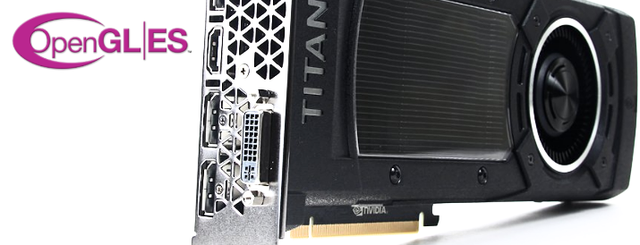

# io-gles

Nim bindings for OpenGL ES, the embedded 3D graphics library.

## About

TODO

## Supported Platforms

TODO

## Prerequisites

TODO

## Dependencies

io-gles does not have any dependencies to other Nim packages at this time.

## Usage

TODO

## Support

Please [file an issue](https://github.com/nimious/io-gles/issues), submit a
[pull request](https://github.com/nimious/io-gles/pulls?q=is%3Aopen+is%3Apr)
or email us at info@nimio.us if this package is out of date or contains bugs.

## References

* [OpenGL ES Standard Homepage](https://www.khronos.org/opengles/)
* [Nim Programming Language](http://nim-lang.org/)
